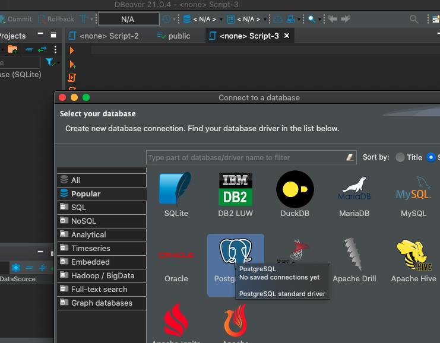
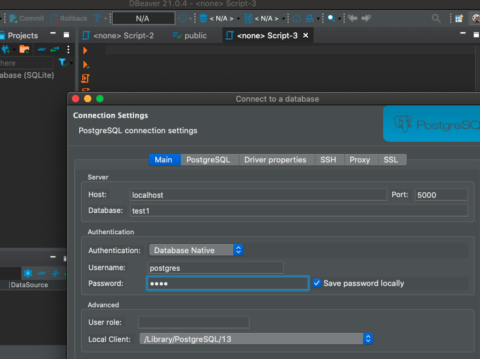
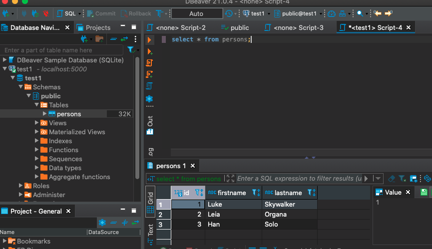

# Dockerized simple Ruby/Sinatra app and node.ks/koa connected to a PostgreSQL database

All apps are dockerized and connected to a Postgres dockerized db.
It simply displays(at port 9000 for Ruby and port 3000 for Node) the connection to the database and saves the request (ip and container id) to the database.

The Postgres container has been opened (port 5000 here) for testing purposes. We use the gem `pg` and the ORM `'sequel` on top of it.

## Start up

- remove the volume `docker volume rm db-vol`
- remove the image `docker image rm db-img` if you want to change the name of the database
- run `docker-compose up --build`.
- the app is available at `port:9000` and `port:3000`
- the Postgres db is opened at `port 5000` for testing purposes, e.g. using <https://dbeaver.io>.

## Env variables between Postgres, Sinatra

- PG: Postgres uses environment variables: `POSTGRES_DB`, `POSTGRES_USER`, `POSTGRES_PASSWORD`. They are passed to the PG container via the `.env` file.

- SINATRA: we use the `dotenv` gem to read the env variables.
  It should be loaded as early as possible in the **config.ru** file with `require 'dotenv'; Dotenv.load('../.env')`

> We can access the variables with `ENV['PORT']` or `ENV.fetch('PORT') { 9292 }`,
> the latter raises an exception if not present and also yield a default value.

## Connection between the app container and the db container

When using Docker, we pass the env var `POSTGRES_HOST=db` where **db** is the name of the postgres service (named in **docker-compose.yml**).

> when we don't use containers (i.e. we just do `rackup`), then the host is "localhost"

Indeed, when we use containers, if we use **host: localhost** for the ORM adapter, this would mean that we are trying to connect to localhost inside of the app container, and there is nothing there. In fact, what we want is to connect to the the postgres container (at port 5432), so we specify `host: POSTGRES_HOST ( = "db" )` where the Postgres service is named **db** here.

## DB adapters

- ruby: the database can be accessed from the ruby app by the ORM `sequel`.
  It allows to query the database **without a model**.

- postgres: in the docker-compose file, we mapped 5000:5432 to make the db container accessible,
  for example via DBeaver.

## Postgres init

We create a table and populate it with a **sql** request in an initiazation script.
We add an `*.sql` script under `/docker-entrypoint-initdb.d` The database

## Node.js & Koa container

<https://semaphoreci.com/community/tutorials/dockerizing-a-node-js-web-application>

<https://jimfrenette.com/docker/node-js-koa-container/>

> to get IP address, <https://nodejs.org/api/http.html#http_request_socket>

## PM2

<https://pm2.keymetrics.io/docs/usage/docker-pm2-nodejs/>

## Ruby extras:

- code reloader: we used the extension `require "sinatra/reloader"` (`bundle add sinatra-contrib`)

- `pg_db = URI.parse("postgres://postgres:psql@db/5432")` and the methods `host`, `user`, `password`, `scheme` are available.

- Ruby time class: <https://www.rubyguides.com/2015/12/ruby-time/> and <http://strftime.net/>

`bundle exec irb` and then `Bundler.require` to attach all gems.

## Postgres init:

```sql
CREATE TABLE IF NOT EXISTS public.persons (
   id int PRIMARY KEY,
   firstName varchar,
   lastName varchar
   );

INSERT INTO public.persons (id, firstname, lastname) VALUES (1, 'Luke', 'Skywalker'), (2, 'Leia', 'Organa'), (3, 'Han', 'Solo');
```

## DBeaver

Since the postgres container has been opened at port 5000, you can connect from your localhost to a selected database; you need to enter the database name and user / password.





```sh
docker run -p 5000:5423 --name pg-cont --rm -d -v pg-vol:/var/lib/postgresql/data postgres:13.2-alpine

docker exec -it pg-cont psql -U postgres
```

`g_ctl -D /var/lib/postgresql/data -l logfile start`
